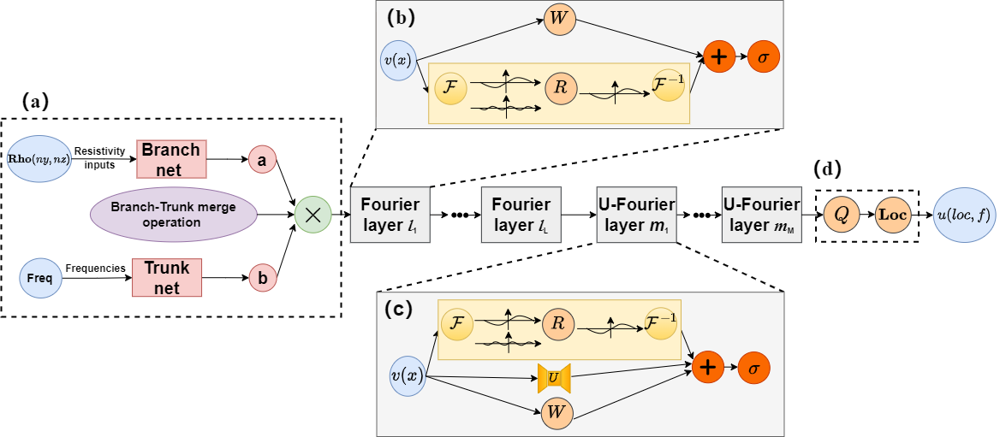
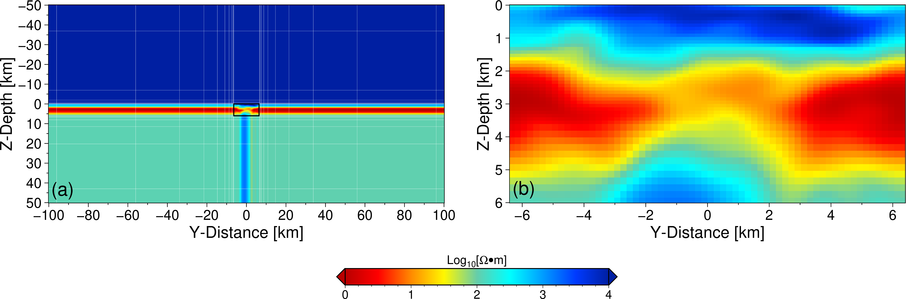

# Extended Fourier DeepONet Neural Operator Network (EFDO) 🚀

If you find this work helpful for your research, please consider citing:

 **Citation:**  

 ```shell
 @article{liao2025fast,
   title={Fast forward modeling of magnetotelluric data in complex continuous media using an extended Fourier DeepONet architecture},
   author={Liao, Weiyang and Peng, Ronghua and Hu, Xiangyun and Zhang, Yue and Zhou, Wenlong and Fu, Xiaonian and Lin, Haikun},
   journal={Geophysics},
   volume={90},
   number={2},
   pages={F11--F25},
   year={2025},
   publisher={Society of Exploration Geophysicists}
 }
 ```

> W. Liao, R. Peng, X. Hu, Y. Zhang, W. Zhou, X. Fu, et al., GEOPHYSICS 2025 Vol. 90 Issue 2 Pages F11-F25, [DOI: 10.1190/geo2023-0613.1](https://library.seg.org/doi/abs/10.1190/geo2023-0613.1)


*The innovative architecture of our Extended Fourier DeepONet (EFDO) neural operator network, combining the power of Fourier transforms with DeepONet for superior performance in geophysical modeling.*

## 🎯 Why EFDO?
EFDO is a cutting-edge neural operator network designed specifically for geophysical modeling tasks. It combines the efficiency of Fourier transforms with the flexibility of DeepONet architecture, offering:
- 📊 Better accuracy
- 💪 Robust performance
- 🔄 Enhanced generalization

## 🖥️ Hardware Requirements
Before you dive in, make sure you have:
- 🎮 NVIDIA GPU (compute capability ≥ 6.0)
- 💾 GPU Memory: 16GB minimum (24GB recommended)
- 🗄️ System Memory: 64GB minimum (256GB recommended)
- 💽 Disk Space: 50GB minimum (512GB recommended)

## 📦 Software Requirements
You'll need these tools in your arsenal:
- 🐧 Ubuntu ≥ 18.04 LTS (or Windows ≥ 10 with WSL2)
- 🐍 Python ≥ 3.7
- 🔥 PyTorch ≥ 1.8.0
- 📚 Essential packages:
  - torchinfo
  - yaml
  - numpy
  - scipy
  - pandas
  - matplotlib
  - jupyter notebook

## 🛠️ Installation

> 💡 Pro tip: We recommend using `Anaconda` with `Mamba` for lightning-fast package installation!

### Step 1: Get Mamba Up and Running
First, grab Mamba from the [Mambaforge download page](https://github.com/conda-forge/miniforge#miniforge):
```bash
bash Miniforge3-Linux-x86_64.sh -b -p ${HOME}/miniforge
```

### Step 2: Set Up Your Environment
Add these magic lines to your `~/.bashrc`:
```bash
# conda
if [ -f "${HOME}/miniforge/etc/profile.d/conda.sh" ]; then
    source "${HOME}/miniforge/etc/profile.d/conda.sh"
fi
# mamba
if [ -f "${HOME}/miniforge/etc/profile.d/mamba.sh" ]; then
    source "${HOME}/miniforge/etc/profile.d/mamba.sh"
fi

alias conda=mamba
```

### Step 3: Create Your EFDO Environment
```bash
conda create -n efdo python=3.8
conda activate efdo
```

### Step 4: Install Dependencies
```bash
# Install PyTorch with CUDA support
conda install pytorch torchvision torchaudio pytorch-cuda=11.7 -c pytorch -c nvidia

# Install other required packages
conda install torchinfo pyyaml numpy scipy pandas matplotlib jupyter notebook
pip install ray
```

### Step 5: Get the Code
```bash
git clone https://github.com/CUG-EMI/EFDO
```

## 🎲 Dataset Generation

### Option 1: Python Method 
Quick and parallel dataset generation:
```bash
python model_gen.py 100 50 train_gen
```
- `100`: Number of datasets
- `50`: Parallel processes
- `train_gen`: Output filename

### Option 2: Julia Method
```bash
julia juliaCallGRF.jl
```
> In this command, the generated datasets will be saved in the `data` directory. But it is worth noting that the julia code only generates the Gaussian random field models, and you need to calculate the forward modeling results using other forward modeling codes. In this research, we use our own `MT2D` julia forward modeling code to calculate the forward modeling results. And the forward modeling code is not open source.
>
> 🔧 Note: For Julia users, set up PyCall first:
```julia
ENV["PYTHON"] = "Path of the python environment"
using Pkg
Pkg.add("PyCall")
Pkg.build("PyCall")
```

### ⚠️ Important Note on Forward Modeling
The Python forward modeling code included in this repository (which is not our original work, for more details see [EFNO_GRF](https://github.com/zhongpenggeo/EFNO)) has some limitations and potential issues. Therefore, we recommend:

1. Use only the Gaussian random field part of this code to generate the conductivity models
2. Employ other well-established forward modeling codes to calculate the MT responses
3. This approach ensures more reliable and accurate dataset generation

This separation of model generation and forward computation allows for:
- Better quality control of the synthetic data
- More flexibility in choosing appropriate forward modeling algorithms
- Increased reliability of the training dataset

If you need recommendations for alternative forward modeling codes, please refer to established MT modeling software in the geophysical community.

### 📥 Pre-generated Datasets
Don't want to generate data? No problem! Download our pre-generated datasets from [Google Drive datasets](https://drive.google.com/drive/folders/1vH-VZ3oBVP0ooxsk6kqALuIM_vQxroz9?usp=drive_link)

## 🎓 Training Your Network

### Configuration
1. Navigate to the `code` directory
2. Edit `config_EFDO.yaml` with your paths and parameters

### Training Commands
```bash
# change to the code directory
cd code
# activate environment
conda activat efdo
# Train EFDO
python EFDO_main.py EFDO_config

# Train EFNO
python EFNO_main.py EFNO_config

# Train UFNO3d
python UFNO3d_main.py UFNO3d_config
```

### 🔬 Visualization and Analysis
Check out our Jupyter notebooks (*.ipynb) in the `code` directory for:
- Result visualization
- Performance analysis
- Model comparisons

### 🏆 Pre-trained Models
Get a head start with our pre-trained models from [Google Drive pre-trained models](https://drive.google.com/drive/folders/1Iutq03q0VAa0HouYRPX1aHh7Iuksw6gc?usp=drive_link), you can download them and put them in the `temp_model` directory, and then you can use the trained models in the `jupyter notebook` file to predict the forward responses.

---
Ready to revolutionize your geophysical modeling? Let's get started! 🚀

For questions and support, open an issue in our GitHub repository or contact our team.

# 🎨 EFDO Neural Network Visualization Guide

## 🌟 Introduction

Welcome to the visualization guide for the EFDO Neural Network! To help researchers in geophysics better understand and utilize our open-source neural operator network, we're excited to share all the plotting scripts used in our paper.

### 📊 Data Visualization Tools

All figures in this study were created using Generic Mapping Tools (GMT). To promote broader adoption and understanding of GMT within the research community, we provide scripts in three different formats:

- 🖥️ **Traditional GMT Scripts**: For command-line interface enthusiasts
- 🐍 **PyGMT Scripts**: For Python users seeking a more familiar syntax
- ⭐ **Julia GMT Scripts**: For Julia users preferring GMT functionality in Julia

> 💡 Pro Tip: Choose the format that matches your programming style - they all produce identical, publication-quality results!

## 🎯 Example: Reproducing Paper Figures

Let's take a look at one of our key figures and how you can reproduce it using any of the three supported approaches:


*Figure: The discretization method of resistivity structures in MT forward modeling.*

### 🛠️ Three Implementation Approaches

- 🖥️ GMT Script 
```shell
#!/usr/bin/env bash
function preset1()
{
    ymin=-100000
    ymax=100000
    zmin=-50000
    zmax=50000
    scale=1000
    ymin=`echo $ymin  $scale | awk '{print ($1/$2)}'`
    ymax=`echo $ymax  $scale | awk '{print ($1/$2)}'`
    zmin=`echo $zmin  $scale | awk '{print ($1/$2)}'`
    zmax=`echo $zmax  $scale | awk '{print ($1/$2)}'`
    echo $ymin $ymax $zmin $zmax
    range_yz1=$ymin/$ymax/$zmin/$zmax
}
preset1

gmt set FONT_ANNOT_PRIMARY 12p
gmt set FONT_LABEL 14p
gmt set MAP_FRAME_PEN 1p,black

# x=0 slice 
gmt begin Figure5 pdf,png
gmt makecpt -Cthermal.cpt -T0/4.0/0.01 -Z -H > rbow.cpt
gmt grdconvert wholeRangeGrids.grd out.grd
gmt grdedit out.grd -R$range_yz1 -Gresult.nc

gmt basemap -Bxa20f10+l"Y-Distance [km]" -Bya10f5+l"Z-Depth [km]" -BWStr -R$range_yz1 -JX12c/-6c
gmt grdimage -R$range_yz1 -JX12c/-6c result.nc -Crbow.cpt 

# y grid lines
gmt plot -Wfaint,white line_y.txt -Frs

# z grid lines
gmt plot -Wfaint,white line_z.txt -Frs

# the core region
gmt plot  -W0.8p <<EOF
-6.4 0
-6.4 6.0
6.4 6.0
6.4 0
-6.4 0
EOF

gmt text -F+f16p,Helvetica << EOF
-93 43 (a) 
EOF

function preset2()
{
    ymin=-6400
    ymax=6400
    zmin=0
    zmax=6000
    scale=1000
    ymin=`echo $ymin  $scale | awk '{print ($1/$2)}'`
    ymax=`echo $ymax  $scale | awk '{print ($1/$2)}'`
    zmin=`echo $zmin  $scale | awk '{print ($1/$2)}'`
    zmax=`echo $zmax  $scale | awk '{print ($1/$2)}'`
    echo $ymin $ymax $zmin $zmax
    range_yz2=$ymin/$ymax/$zmin/$zmax
}
preset2
gmt grdconvert coreRangeGrids.grd out.grd
gmt grdedit out.grd -R$range_yz2 -Gresult.nc
gmt basemap -Bxa2f1+l"Y-Distance [km]" -Bya1f1+l"Z-Depth [km]" -BWStr -R$range_yz2 -JX12c/-6c -X14
gmt grdimage -R$range_yz2 -JX12c/-6c result.nc -Crbow.cpt 

gmt text -F+f16p,Helvetica << EOF
-5.95 5.55 (b) 
EOF

gmt colorbar -R$range_yz1 -Crbow.cpt -DjTC+w8c/0.5c+o-7.0c/8.0c+ml+e -N -Bxaf+l"Log@-10@-[@~W\267@~m]" -By -FONT_ANNOT_PRIMARY=15p

rm out.grd rbow.cpt *.nc

gmt end
```
- 🐍 PyGMT Script
```python
import pygmt

def preset1():
    # Convert range units to kilometers
    ymin, ymax, zmin, zmax = -100, 100, -50, 50  # Assuming these values are already in kilometers
    return ymin, ymax, zmin, zmax

def preset2():
    # Convert range units to kilometers
    ymin, ymax, zmin, zmax = -6.4, 6.4, 0, 6  # Again, assuming these values are already in kilometers
    return ymin, ymax, zmin, zmax

# Set file and directory paths
dir_path = "./"
cpt_file_in = f"{dir_path}thermal.cpt"
cpt_file_out = f"{dir_path}rbow.cpt"
result1_grid = f"{dir_path}result1.grd"
result2_grid = f"{dir_path}result2.grd"
out_pdf_png = f"{dir_path}Figure5_py"

# Set range by calling functions
ymin, ymax, zmin, zmax = preset1()
range_yz1 = f"{ymin}/{ymax}/{zmin}/{zmax}"

pygmt.config(FONT_ANNOT_PRIMARY="12p", FONT_LABEL="14p", MAP_FRAME_PEN="1p,black")

fig = pygmt.Figure()
pygmt.makecpt(cmap=cpt_file_in, series="0/4.0/0.01", continuous=True, output=cpt_file_out)

# Convert grid range using grdedit in original GMT, currently, PyGMT does not support grdedit and grdconvert modules
# gmt grdedit wholeRangeGrids.grd -R-100/100/-50/50 -Gresult1.grd

fig.grdimage(grid=result1_grid, region=range_yz1, projection="X12c/-6c", cmap=cpt_file_out, frame=["xa20f10+lY-Distance [km]", "ya10f10+lDepth [km]", "WStr"])
fig.plot(data=f"{dir_path}line_y.txt", pen="faint,white")
fig.plot(data=f"{dir_path}line_z.txt", pen="faint,white")
fig.plot(data=[[-6.4, 0], [-6.4, 6.0], [6.4, 6.0], [6.4, 0], [-6.4, 0]], pen="0.8p")
fig.text(x=-93, y=43, text="(a)", font="16p,Helvetica")

ymin, ymax, zmin, zmax = preset2()
range_yz2 = f"{ymin}/{ymax}/{zmin}/{zmax}"

# Convert grid range using grdedit in original GMT, currently, PyGMT does not support grdedit and grdconvert modules
# gmt grdedit coreRangeGrids.grd -R-6.4/6.4/0/6 -Gresult2.grd

fig.shift_origin(xshift="14c")
fig.grdimage(grid=result2_grid, region=range_yz2, projection="X12c/-6c", cmap=cpt_file_out, frame=["xa2f1+lY-Distance [km]", "ya1f1+lDepth [km]", "WStr"])
fig.text(x=-5.95, y=5.55, text="(b)", font="16p,Helvetica")

pygmt.config(FONT_ANNOT_PRIMARY="14p", FONT_LABEL="14p")
fig.colorbar(cmap=cpt_file_out, frame=["xaf+lLog@-10@-[@~W\267@~m]", "y"], position="jTC+w8c/0.5c+o-7.0c/8.0c+ml+e")

# Save in PDF and PNG formats
fig.savefig(f"{out_pdf_png}.pdf")
fig.savefig(f"{out_pdf_png}.png")

```

- ⭐ Julia GMT Script
```julia
using GMT

function preset1()
    ymin = -100000
    ymax = 100000
    zmin = -50000
    zmax = 50000
    scale = 1000
    ymin /= scale
    ymax /= scale
    zmin /= scale
    zmax /= scale
    println("$ymin $ymax $zmin $zmax")
    range_yz1 = string(ymin, "/", ymax, "/", zmin, "/", zmax)
    return range_yz1
end

function preset2()
    ymin = -6400
    ymax = 6400
    zmin = 0
    zmax = 6000
    scale = 1000
    ymin /= scale
    ymax /= scale
    zmin /= scale
    zmax /= scale
    println("$ymin $ymax $zmin $zmax")
    range_yz2 = string(ymin, "/", ymax, "/", zmin, "/", zmax)
    return range_yz2
end

range_yz1 = preset1()
range_yz2 = preset2()

gmtbegin("Figure5_jl", fmt="pdf,png")

	# Create a color palette
	C = makecpt("-Cthermal.cpt -T0/4/0.1 -Z > rbow.cpt")

	# Figure (a)
	data1 = grdedit("wholeRangeGrids.grd", region=range_yz1)
	basemap!(region=range_yz1, figsize=(12, -6), frame=(axes=:WStr,),
			 xaxis=(annot=20, ticks=10, label=:"Y-Distance [km]"), 
             yaxis=(annot=10, ticks=5, label=:"Z-Depth [km]"),
			 par=(FONT_ANNOT_PRIMARY=12, FONT_LABEL=14, MAP_FRAME_PEN="1p,black",)
			) 
	grdimage!(data1, region=range_yz1, figsize=(12, -6), cmap="rbow.cpt")
	plot!("line_y.txt", pen=(0.1, :White))
	plot!("line_z.txt", pen=(0.1, :White))
	boxline = [-6.4 0;-6.4 6.0;6.4 6.0;6.4 0;-6.4 0]
	plot!(boxline, pen="0.8p", close=true)
	text!(["(a)"], font=16, x=-93, y=43)

	# Figure (b)
	data2 = grdedit("coreRangeGrids.grd", region=range_yz2)
	basemap!(region=range_yz2, figsize=(12, -6), frame=(axes=:WStr,),
			 xaxis=(annot=2, ticks=1, label=:"Y-Distance [km]"), 
             yaxis=(annot=1, ticks=1, label=:"Z-Depth [km]"),
			 par=(FONT_ANNOT_PRIMARY=12, FONT_LABEL=14,MAP_FRAME_PEN="1p,black",),
			 xshift=14
			) 
	grdimage!(data2, region=range_yz2, figsize=(12, -6), cmap="rbow.cpt")
	text!(["(b)"], font=16, x=-5.95, y=5.55)

	# Adding the colorbar
	gmtset(FONT_ANNOT_PRIMARY = "14p,Helvetica,black", FONT_LABEL = "14p,black")
	colorbar!(xaxis=(annot=1, ticks=0.2, label=:"Log@-10@-[@~W\267@~m]"), 
			  pos=(paper=true, anchor=(-5,-2.5), size=(8,0.5), horizontal=true,
			  move_annot=:l, triangles=true))

gmtend()
```

As you can see, each approach achieves the same result while catering to different programming preferences and workflows.

## 🚀 Setup and Installation

### 📦 Installation Guide

#### 1️⃣ GMT and PyGMT Setup
We recommend using conda to create dedicated environments:

```bash
# Setting up GMT
conda create -n gmt python=3.12
conda activate gmt
conda install -c conda-forge gmt
# if `gmt --version` displays some error, please try the following way
conda remove gdal sqlite 
conda install -c conda-forge gmt gdal sqlite
conda update gmt

# Setting up PyGMT
conda create -n pygmt python=3.12
conda activate pygmt
conda install numpy scipy pandas xarray netcdf4 packaging pygmt
```

#### 2️⃣ Julia GMT Setup
For Julia users, it's just one line:
```julia
using Pkg
Pkg.add("GMT")  # That's all!
```

> 💡 Recommendation: We suggest using the latest version of GMT in WSL2 with Ubuntu for the best experience!

## 🎮 Usage Guide

### 📊 Using the Plotting Scripts
All figure scripts are located in the `Plotting_scripts` directory:

```bash
cd Plotting_scripts/Figure5

# For GMT users
conda activate gmt
bash Figure5.sh

# For Python users
conda activate pygmt
python Figure5.py

# For Julia users
julia Figure5.jl
```

### 📓 Jupyter Notebook Support
We also provide `Geophysics_plotting_scripts.ipynb` which includes:
- 📈 Code for all figures
- 🔍 Detailed step-by-step explanations
- 📝 Interactive environment

## 🌈 Getting Help
- 📚 Visit the [GMT official documentation](https://www.generic-mapping-tools.org/)
- 💬 Join GMT community discussions
- 🐛 Submit issues on GitHub

